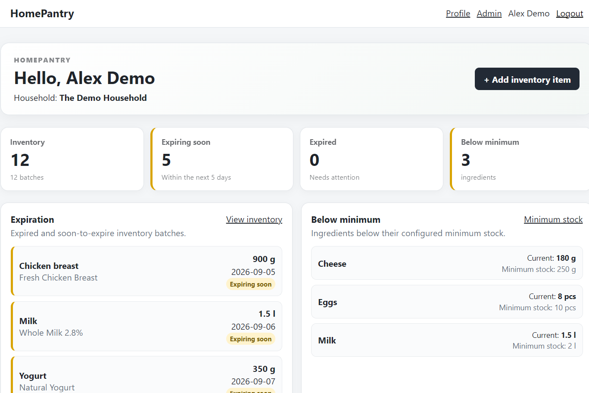
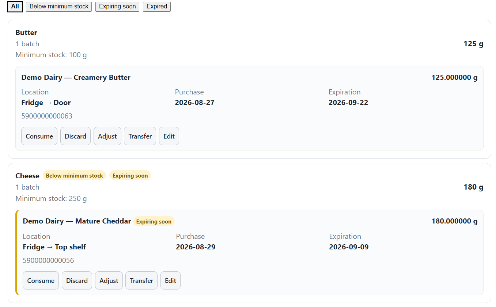
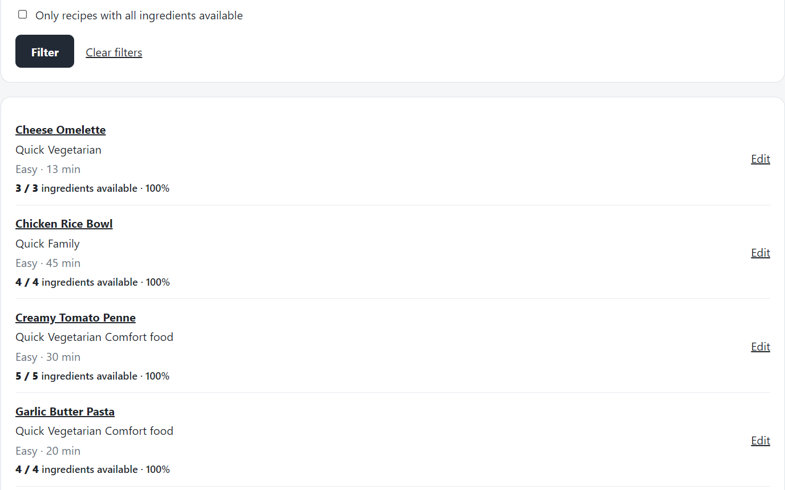
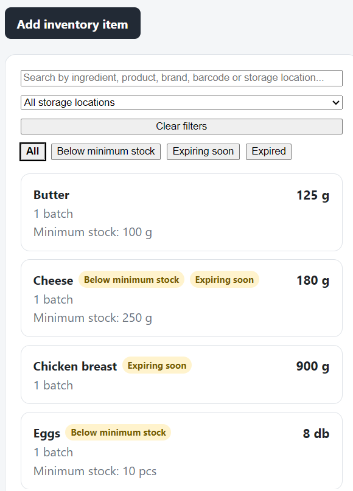

# HomePantry

HomePantry is a self-hosted household pantry, inventory, and recipe
management application with a bilingual Hungarian and English interface.

It is designed for practical everyday use on desktop and mobile devices,
with support for products, ingredients, storage locations, stock tracking,
barcodes, recipes, and household members.

> **Status:** `0.1.0-alpha.1`
>
> This is the first public alpha release.

## Features

- Household-based multi-user setup
- Hungarian and English user interface
- Ingredient master data
- Ingredient categories, aliases, units, and substitutions
- Product catalog with multiple barcodes
- Browser-based barcode scanning
- Open Food Facts product metadata lookup
- Product and storage-location images
- Hierarchical storage locations
- Inventory batches and movement history
- Low-stock rules
- Recipe management
- Recipe tags and images
- Recipe availability based on current inventory
- Online recipe search and import through TheMealDB
- Measurement normalization for imported recipes
- Optional local recipe translation with LibreTranslate
- PostgreSQL database
- Alembic migrations
- Gunicorn and systemd deployment
- Reverse-proxy and application-prefix support
- Health-check endpoint
- Automated Ubuntu installation

## Screenshots

### Dashboard

A quick overview of your household pantry, including stock status and items that need attention.



### Inventory

Track ingredients and products, quantities, storage locations and expiration dates.



### Recipes

Browse your recipe collection and see what you can prepare from the ingredients currently available at home.



### Mobile

HomePantry is designed to remain practical on phones as well as desktop browsers.



## Requirements

Recommended platform:

- Ubuntu 24.04 LTS
- PostgreSQL
- Python 3.12
- systemd
- A modern web browser

Docker is only required for the optional LibreTranslate deployment.

## Installation

See:

- [Installation guide](docs/INSTALL.md)
- [Magyar telepítési útmutató](docs/INSTALL.hu.md)

For a standard Ubuntu installation:

```bash
sudo ./install.sh
```

The installer prepares:

- PostgreSQL
- application user
- Python virtual environment
- dependencies
- environment configuration
- database migrations
- reference data
- systemd service
- health check

## First use

After installation, open:

```text
http://SERVER_IP:8084/
```

Create the first account through the registration page.

The first registered user creates a household and becomes its owner.

## Reverse proxy and Tailscale

HomePantry supports running behind a reverse proxy under an application
prefix such as:

```text
/homepantry
```

Set:

```env
APPLICATION_PREFIX=/homepantry
```

The application can still remain directly accessible on the LAN at `/`.

## Optional recipe translation

HomePantry can use a separately deployed LibreTranslate service for
English-to-Hungarian translation of imported recipes.

Install it with:

```bash
sudo ./deploy/install-libretranslate.sh
```

If LibreTranslate is unavailable, recipe import remains functional and
the original English text is kept.

## External services

HomePantry optionally integrates with:

- Open Food Facts
- TheMealDB
- LibreTranslate

Barcode scanning uses the bundled Quagga2 library.

See [THIRD_PARTY_NOTICES.md](THIRD_PARTY_NOTICES.md) for licensing and
attribution details.

## Data and backups

HomePantry stores application data in PostgreSQL and uploaded images in
the application upload directories.

Back up both the database and uploaded media regularly.

Before upgrading between alpha releases, always create a current backup.

## Development status

HomePantry is already used as a real household application, but its public
distribution is still in alpha.

Expect installation, configuration, migrations, and documentation to evolve
during the alpha releases.

Bug reports and feedback are welcome.

## License

HomePantry is released under the MIT License.

See [LICENSE](LICENSE).

## Support

If you find HomePantry useful and would like to support its development:

https://www.patreon.com/c/ZoltanRigo
